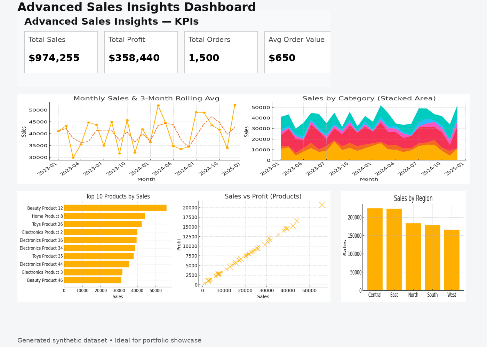

# 📊 Sales Insights Dashboard (Power BI & Tableau)

## 🚀 Project Overview
This is an **end-to-end Sales Insights Dashboard** project built with **Power BI** and **Tableau**.  
It includes clean datasets, data modeling, DAX/ETL scripts, and dashboard outlines.  
You can open it directly in **Power BI Web/Desktop** or **Tableau Public**.

---

## 📂 Repository Contents
- `orders.csv` — transactional sales data (1,500 rows)  
- `products.csv` — product master (50 products)  
- `customers.csv` — customer master (200 customers with region info)  
- `calendar.csv` — date table for time intelligence  
- `DAX_measures.txt` — ready-to-use DAX measures for Power BI  
- `PowerQuery_M.txt` — ETL transformation queries for Power BI  
- `INSTRUCTIONS.md` — step-by-step guide for Power BI & Tableau  
- `REPORT_OUTLINE.md` — dashboard pages & visuals outline  
  

---

## 🖼️ Dashboard Preview

---

## 🔑 Key Features
- 📆 **Time-based insights** (YTD, MoM, LY comparisons)  
- 🛍️ **Top products & categories** by sales  
- 🌍 **Regional performance** analysis  
- 💰 **Profitability & margin** breakdowns  
- ⚡ **Interactive filters & slicers** for drilldown  

---

## ⚙️ How to Use
### Option A — Power BI Web
1. Go to [Power BI Web](https://app.powerbi.com).  
2. Upload all CSVs (`orders.csv`, `products.csv`, `customers.csv`, `calendar.csv`).  
3. Create relationships:
   - `orders.CustomerID → customers.CustomerID`  
   - `orders.ProductID → products.ProductID`  
   - `orders.OrderDate → calendar.Date`  
4. Paste measures from `DAX_measures.txt`.  
5. Build dashboards → Publish to web.

### Option B — Power BI Desktop
1. Import all CSVs.  
2. Use **Power Query** (snippets in `PowerQuery_M.txt`) for cleaning & merging.  
3. Add **DAX measures** from `DAX_measures.txt`.  
4. Design dashboards using `REPORT_OUTLINE.md`.  
5. Save `.pbix` → Publish.

### Option C — Tableau Public
1. Connect to all CSV files.  
2. Join:
   - `orders.ProductID = products.ProductID`  
   - `orders.CustomerID = customers.CustomerID`  
3. Build dashboards (similar to DAX logic).  
4. Save & publish on Tableau Public.

---

## 📊 Suggested Dashboard Pages
1. **Executive Summary** → KPIs & quick trends  
2. **Sales Trend & Forecast** → time analysis  
3. **Product Performance** → top products & categories  
4. **Customer & Region** → sales by customer & region  
5. **Operational Insights** → order priority, profitability  

---

## 🛠️ Skills Demonstrated
- Data Cleaning (Power Query, Tableau Prep)  
- Data Modeling (star schema relationships)  
- DAX Measures & Time Intelligence  
- ETL Process Design  
- Business Intelligence Dashboarding  
- Data Visualization Best Practices  

---

## 📜 License
MIT License — Free to use for learning & portfolio purposes.

---

## 🙌 Acknowledgements
This dataset is **synthetic** and generated for learning.  
Feel free to fork ⭐ this repo and build your own dashboards!
